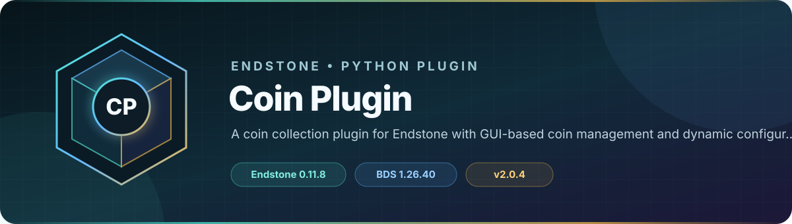

<!-- endstone-professional-header:start -->
<p align="center">
  
</p>

<p align="center">
  <a href="https://github.com/TheNINJALLO/endstone-coin-plugin/actions/workflows/wheel-release.yml"></a>
  <a href="https://github.com/TheNINJALLO/endstone-coin-plugin/releases/latest"></a>
</p>

<p align="center">
  
  
  
  =3.10" src="https://img.shields.io/badge/Python-%3E=3.10-3776AB?style=flat-square&amp;logo=python&amp;logoColor=white">
</p>

<p align="center">
  <strong>A coin collection plugin for Endstone with GUI-based coin management and dynamic configuration.</strong>
</p>

<p align="center">
  <a href="#what-it-does">What it does</a> &bull;
  <a href="#how-to-use">How to use</a> &bull;
  <a href="#commands-and-permissions">Commands</a> &bull;
  <a href="#install">Install</a> &bull;
  <a href="https://github.com/TheNINJALLO/endstone-coin-plugin/releases">Releases</a>
</p>

## Overview

A coin collection plugin for Endstone with GUI-based coin management and dynamic configuration. This release is aligned with Endstone 0.11.8 and Minecraft Bedrock Dedicated Server 1.26.40, and is distributed as a Python wheel for direct installation in an Endstone server.

## What it does

- Converts configured custom coin items into points on a scoreboard objective such as `Money`.
- Deposits an entire held stack on right-click and confirms the credited value through sound and action-bar feedback.
- Loads coin definitions from persistent JSON and exposes a small programmatic management API.

## How to use

1. Start once to create `coins.json`, then match each entry to the item identifiers supplied by your behavior/resource pack.
2. Verify that the configured scoreboard objective exists.
3. A player deposits coins by holding a configured coin stack and right-clicking the air.
4. Edit `coins.json` and restart, or call the documented plugin API, when adding or changing coin types.

## Commands and permissions

This plugin registers no player commands. Deposits are item-driven: hold a configured coin and right-click the air. Administrators manage coin definitions in `coins.json` or through the Python API documented below.

## Compatibility

| Component | Supported version |
|---|---|
| Endstone | `0.11.8` |
| Endstone API | `0.11` |
| Bedrock Dedicated Server | `1.26.40` |
| Python | `>=3.10` |
| Plugin release | `v2.0.4` |

## Install

Download the wheel from the matching GitHub release:

```bash
gh release download v2.0.4 --repo TheNINJALLO/endstone-coin-plugin --pattern "*.whl"
```

Copy the downloaded wheel into the server's `plugins/` directory, remove any older wheel for the same plugin, and restart Endstone.

> [!IMPORTANT]
> Use Endstone `0.11.8` with BDS `1.26.40`. Back up worlds and plugin data before upgrading a production server.

## Configuration and secrets

Runtime databases, logs, local `.env` files, server directories, and root `config.toml` files are excluded from source releases. When an example configuration is provided, copy it locally and keep live tokens, passwords, webhook URLs, and server identifiers out of Git.

## Release automation

Every `v*` tag runs [the wheel release workflow](.github/workflows/wheel-release.yml), builds the package in a clean GitHub runner, stores the wheel as a workflow artifact, and attaches it to the matching GitHub release.
<!-- endstone-professional-header:end -->

---

## Project guide

A plugin for Endstone (Bedrock Dedicated Server) that allows players to convert custom coins into scoreboard currency.

## Features

- Supports configurable coin types with varying values
- Automatically adds coin value to player's Money scoreboard
- Removes coins from inventory when deposited
- Plays a sound and shows action bar message on deposit
- Right-click in air to deposit coins
- **NEW**: Dynamic coin configuration system
- **NEW**: Persistent coin configuration saved to JSON file
- **NEW**: Programmatic API for coin management
- **NEW**: Runtime coin reloading without server restart

## Coin Types

| Coin Name | Display Name | Value |
|-----------|--------------|-------|
| `ninjos:coin_wood` | §6Wooden TK Coin | $1 |
| `ninjos:coin_glass` | §7Glass TK Coin | $5 |
| `ninjos:coin_iron` | §8Iron TK Coin | $25 |
| `ninjos:coin_emerald` | §2Emerald TK Coin | $100 |
| `ninjos:coin_ruby` | §cRuby TK Coin | $500 |
| `ninjos:coin_gold` | §eGolden TK Coin | $1,000 |
| `ninjos:coin_diamond` | §bDiamond TK Coin | $10,000 |
| `ninjos:coin_netherite` | §8Netherite TK Coin | $1,000,000 |

## Installation

1. Ensure you have Endstone 0.11.8 or higher installed in your Python environment:
```bash
pip install endstone>=0.11.8,<0.12
```

2. Create the plugin directory structure:
```
endstone-coin-plugin/
├── pyproject.toml
├── README.md
└── src/
    └── endstone_coin_plugin/
        ├── __init__.py
        └── coin_plugin.py
```

3. Install the plugin in development mode:
```bash
cd endstone-coin-plugin
pip install -e .
```

4. Start or restart your Endstone server

5. Verify the plugin loaded successfully by checking the server logs for:
```
[INFO] Coin Plugin is loading...
[INFO] Coin Plugin has been enabled!
[INFO] Money scoreboard objective created successfully
```

## Usage

### For Players
Players simply need to:
1. Hold a coin item in their hand
2. Right-click in air (not on a block)
3. The coin stack will be converted to Money scoreboard points
4. A confirmation message will appear in the action bar

### For Administrators
Administrators can manage coins through several methods:

#### Method 1: JSON File Configuration
1. Edit `plugins/endstone-coin-plugin/coins.json`
2. Add, modify, or remove coin entries
3. Restart server or use reload method

#### Method 2: Programmatic API
```python
# Get plugin instance
coin_plugin = server.plugin_manager.get_plugin("coin-plugin")

# Add a new coin
coin_plugin.add_coin("Money", "§5Purple Coin §f$250", "ninjos:coin_purple", 250)

# Remove a coin
coin_plugin.remove_coin("ninjos:coin_purple")

# Reload from file
coin_plugin.reload_coins_from_file()
```

### Coin Configuration Fields
Each coin requires:
- **currency_obj**: The scoreboard objective (usually "Money")
- **display_name**: The formatted name shown to players (supports color codes)
- **points**: How many points the coin is worth (must be positive)
- **name**: The unique item ID (e.g., "ninjos:coin_gold")

See `COIN_MANAGEMENT.md` for detailed configuration guide.

## Directory Structure

```
endstone-coin-plugin/
├── pyproject.toml              # Project configuration and dependencies
├── README.md                   # This file
└── src/
    └── endstone_coin_plugin/   # Main package directory
        ├── __init__.py         # Package initialization
        └── coin_plugin.py      # Main plugin code
```

## Requirements

- Python 3.9 or higher
- Endstone 0.11.8 or higher
- Custom coin items in your resource pack

## Configuration

### Dynamic Configuration (Recommended)
The plugin now supports dynamic coin configuration through the in-game GUI:
- Use `/coinmanager` command to access the management interface
- Coin configurations are automatically saved to `plugins/endstone-coin-plugin/coins.json`
- Changes take effect immediately without server restart
- The JSON file can also be edited manually if needed

### File-based Configuration
Coin data is stored in `plugins/endstone-coin-plugin/coins.json` with the following structure:
```json
[
  {
    "currency_obj": "Money",
    "display_name": "§6Wooden TK Coin §f$1",
    "name": "ninjos:coin_wood",
    "points": 1
  }
]
```

### Legacy Configuration
The plugin includes default coins that are automatically loaded on first run. These can be modified through the GUI or by editing the JSON file directly.

## License

Modify as needed for your project.
